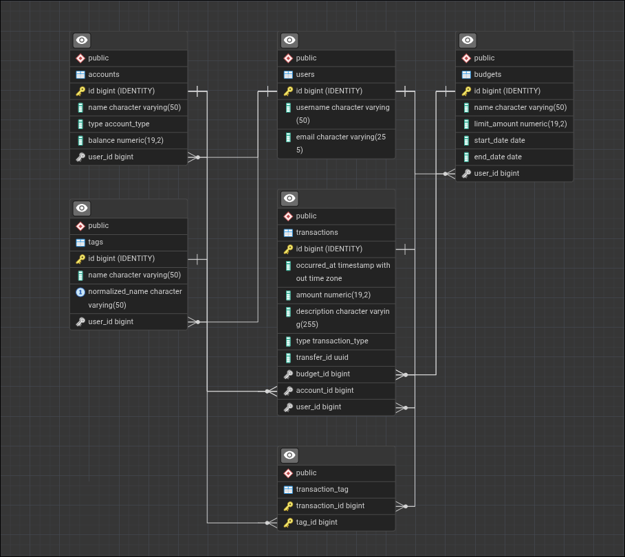

# Finance Tracker

**Finance Tracker** — это приложение для управления личными финансами, которое помогает пользователям контролировать доходы и расходы, а также анализировать своё финансовое состояние. Система предоставляет REST API для работы с данными о пользователях, счетах, транзакциях, категориях и бюджетах, обеспечивая удобное и структурированное взаимодействие с финансовой информацией.

**Стек:** Java 21 · Spring Boot 4 · Spring Data JPA · PostgreSQL

---

## Связи сущностей



---

## API Endpoints

Полная документация API находится: [Документация API](docs/api.md)

## Запуск приложения

### 1. Подготовьте `.env`

Создайте в корне проекта файл `.env`:

```env
POSTGRES_HOST=postgres
POSTGRES_PORT=5432
POSTGRES_DB=finance_tracker
POSTGRES_USER=postgres
POSTGRES_PASSWORD=postgres
```

### 2. Запустите приложение

```bash
docker compose --env-file .env up -d --build
```

### 3. Проверьте, что API поднялось

```bash
curl http://localhost:8080/api/v1/users
```

После запуска API доступно по адресу: `http://localhost:8080`.

### 4. Полезные команды

Логи:

```bash
docker compose logs -f
```

Остановка:

```bash
docker compose down
```

## Транзакции и Entity Graph

**Транзакции:** создание пользователя с несколькими счетами и транзакциями (`POST /api/v1/users/with-accounts-and-transactions`) можно выполнять в одной транзакции (`?transactional=true`) — при ошибке всё откатывается; без транзакции (`?transactional=false`) при сбое в БД остаются частично сохранённые данные.

**Entity Graph:** для избежания N+1 при загрузке связей используются `@EntityGraph` в репозиториях: пользователи со счетами и транзакциями, бюджеты с категориями и транзакциями, а также точечная загрузка одного бюджета/пользователя по id с нужными связями.
