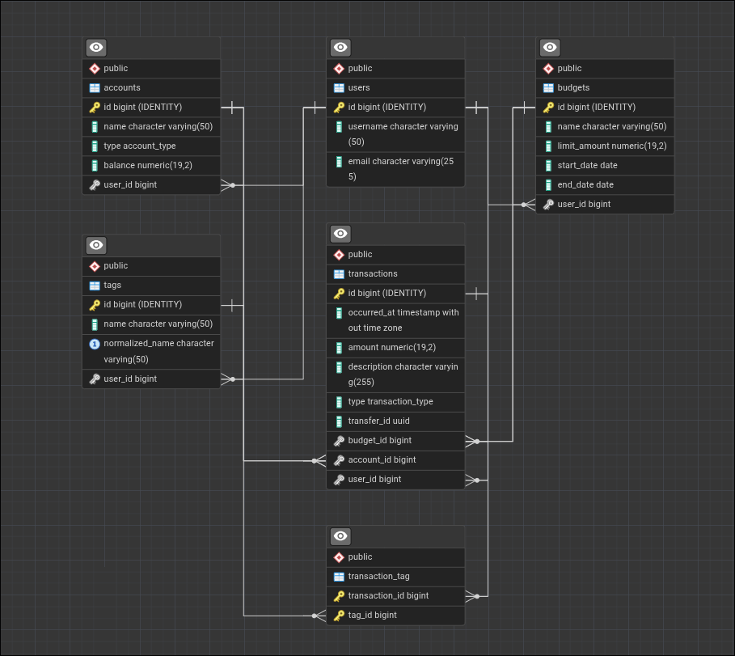

# Finance Tracker

**Finance Tracker** — REST API для управления личными финансами: пользователи, счета, бюджеты, теги, транзакции и переводы между счетами.

**Стек:** Java 21 · Spring Boot 4 · Spring Data JPA · PostgreSQL · Liquibase

---

## Связи таблиц



---

## API

Полная документация: [docs/api.md](docs/api.md)

Основные группы endpoint'ов:

- `/api/v1/users`
- `/api/v1/accounts`
- `/api/v1/budgets`
- `/api/v1/tags`
- `/api/v1/transactions`

Перевод между счетами:

- `POST /api/v1/accounts/transfer?transactional=true|false&failAfterDebit=true|false`

Особенности списка транзакций:

- по умолчанию `GET /api/v1/transactions` скрывает transfer-записи;
- для включения переводов используйте `includeTransfers=true`;
- для демонстрации подгрузки связей доступен `withEntityGraph=true`;
- фильтр по датам использует `startDate` и `endDate` одновременно (`YYYY-MM-DD`).

---

## Запуск приложения

### 1. Подготовьте `.env`

Пример актуальных значений:

```env
POSTGRES_USER=finance-tracker-user
POSTGRES_PASSWORD=finance-tracker-password
POSTGRES_DB=finance-tracker
POSTGRES_PORT=5432
POSTGRES_HOST=pg

FINANCE_TRACKER_PORT=8080
```

### 2. Поднимите стек

```bash
docker compose up -d --build
```

Остановка:

```bash
docker compose down
```

---

## Быстрая проверка API

Примеры запросов после запуска стека:

```bash
curl -s http://localhost:8080/api/v1/users
```

```bash
curl -s -X POST http://localhost:8080/api/v1/users \
  -H "Content-Type: application/json" \
  -d '{"username":"alex","email":"alex@example.com"}'
```

```bash
curl -s "http://localhost:8080/api/v1/transactions?includeTransfers=true"
```

Детальные контракты request/response и бизнес-ограничения описаны в [docs/api.md](docs/api.md).

---

## SonarQube Cloud

[Sonar Analysis](https://sonarcloud.io/summary/new_code?id=ekuzm_FinanceTracker)
